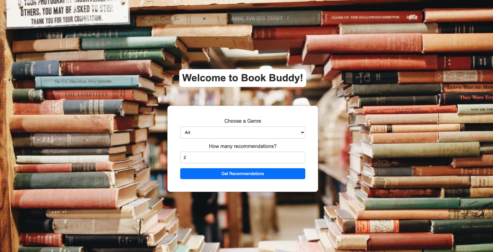
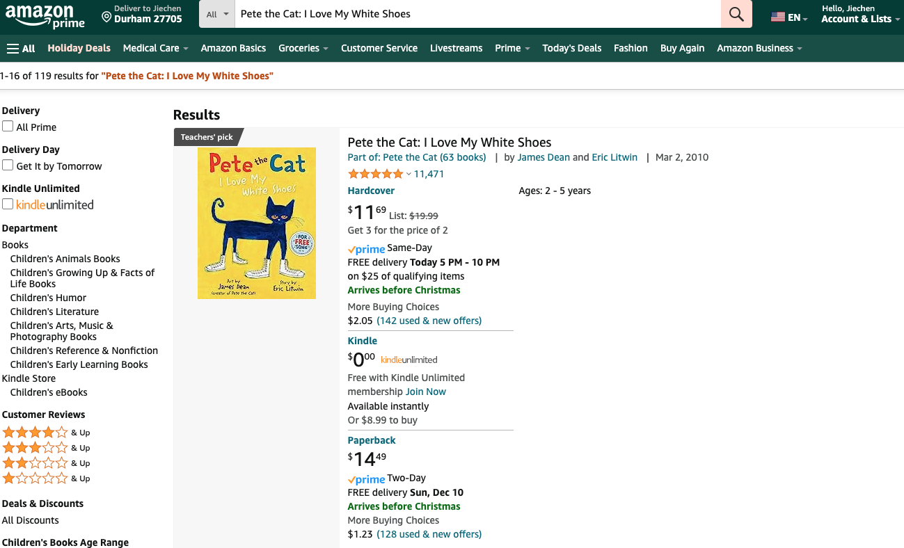
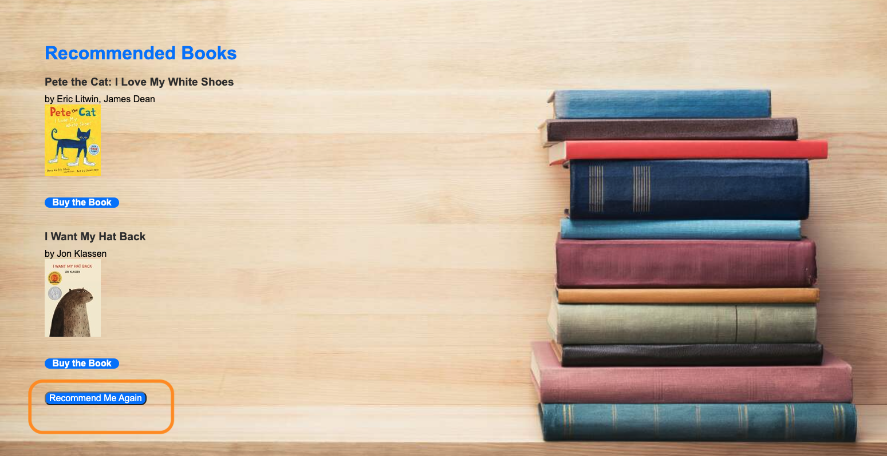
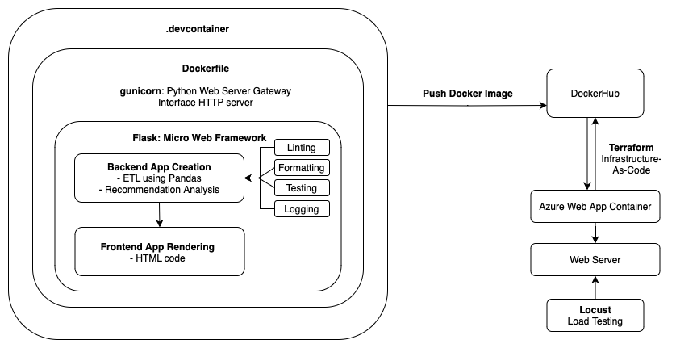
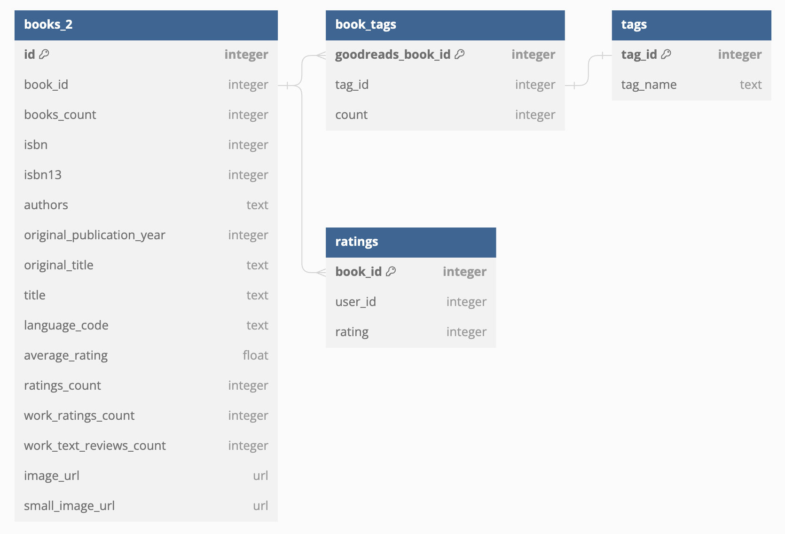
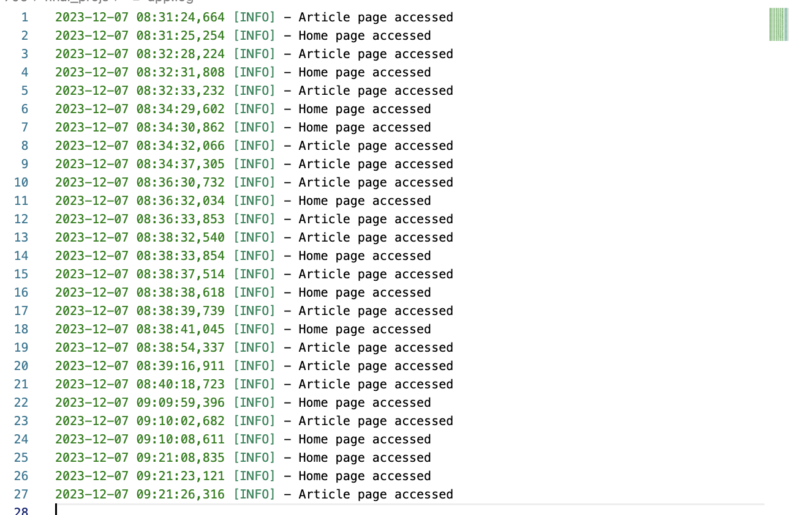
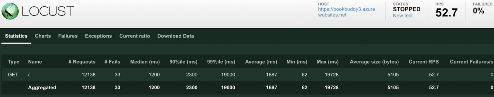
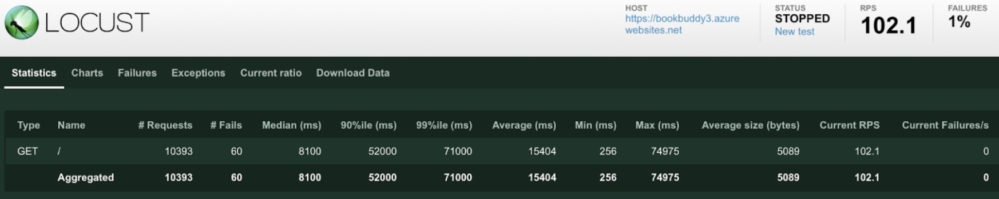
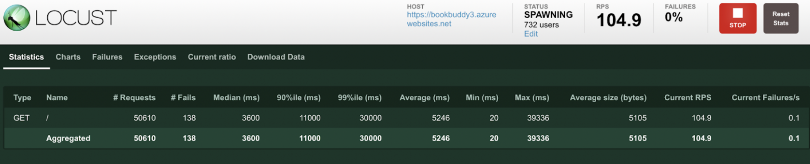
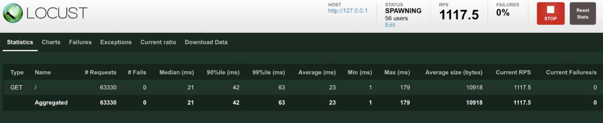

    

# Book Buddy

Data Engineering Systems Final Project by Jiechen Li, Haliunaa Munkhuu, and Lilly Grella

## Project Goals

This app is a microservice that interfaces with a data pipeline. It intends to recommend a book, or books, based on a user-selected genre.
The app has two pages: one focused on the selection of the genre and one focused on the resulting recommended book.
recommendation.py performs the recommendation process for the app.

## Demo Link

Please click this [link](https://bookbuddy3.azurewebsites.net/) to watch our project walk-through video.

## Using Book Buddy

* Go to the following URL: [Book Buddy](https://bookbuddy3.azurewebsites.net/)
* Select the genre you are interested in
* Select how many books you would like to be recommended (Note: a value less than or equal to 0 will not let you continue)

* Click `Get Recommendations`. You will be redirected to a page with the list of books recommended in the genre selected.

* At this point, you can click on `Buy the Book`. This will rerouted you to an Amazon page to purchase the book.

* Alternatively, if you want to be recommended a new set of book or switch genres, click `Recommend Me Again`.

## Building the App

* Step 1: Write recommendation python code
* Step 2: Develop Flask code, developing URLs for different pages for our client
* Step 3: Develop HTML files for website rendering
* Step 4: Create Docker image for Azure to run the app
* Step 5: Deploy to Azure by pulling docker image from DockerHub

## Architectural Diagram

## Data Processing

* There are three csv files that we stored and used as our database: ``books.csv``, ``ratings.csv``, ``tags.csv``, and ``book_tags.csv``.
* The data comes from [Goodreads](https://www.goodreads.com/), and the datasets are pulled from [Kaggle](https://www.kaggle.com/).
* The data is diagrammed as the following:

* After extracting the data and creating Pandas dataframes, we performed transformations to set up the data for our analysis.
* First, we needed to connect genres to books. We use a simplistic approach by scanning user tags for genre names. On Goodreads, when a user rates a book, they can provide tags. For example, a user that rated "Odysseus" typically chooses the "Classics" Tag. This allowed us to create a `genre` category.

## Data Analysis

* Next, we wanted to create a weighted rating system, relying on previous literature and focusing on IDBM's weighting equation.
* For each recommendation instance, we restrict the books for the genre selected to the top 75 books according to our weighted rating. Depending on the number of books the user wants to have recommended, we pull that number of randomly generated records from the top 75 books to display on the website.

## Dependencies

* Recommendation Python Code: Pandas
* App Creation: Flask, HTML, Docker
* Build Tools:
  * Linting: Pylint
  * Testing: Pytest
  * Formatting: Black
  * Deployment: Azure

## Logging

## Load Testing

* After deployment of our app, we used `Locust` to perform load testing. Locust is designed to simulate a swarm of users and determine the scalability of our app.
* We first defined the userbehavior in locustfile.py, after running `locust` in the terminal, we are prompted to visit the locust user interface at <http://localhost:8089>
* To perform load testing, we added various values to the number of users and spawn rate. We found our app was successful during load testing as shown by the below outcomes:

Peak Concurrency: 100, Spawn Rate: 100

Peak Concurrency: 1000, Spawn Rate: 1000

Peak Concurrency: 1000, Spawn Rate: 1000

High RPS:

## Areas for Improvement

* Improving the recommendation algorithm using machine learning techniques such as clustering
* Improving the amazon link process by adding the book to the cart, or bringing the user to the actual product page

## Using AI Programming

* We used GitHub CoPilot to aid in Flask development
* We used codewhisperer and ChatGPT to specifically help develop our frontend HTML code and the python recommendation code
